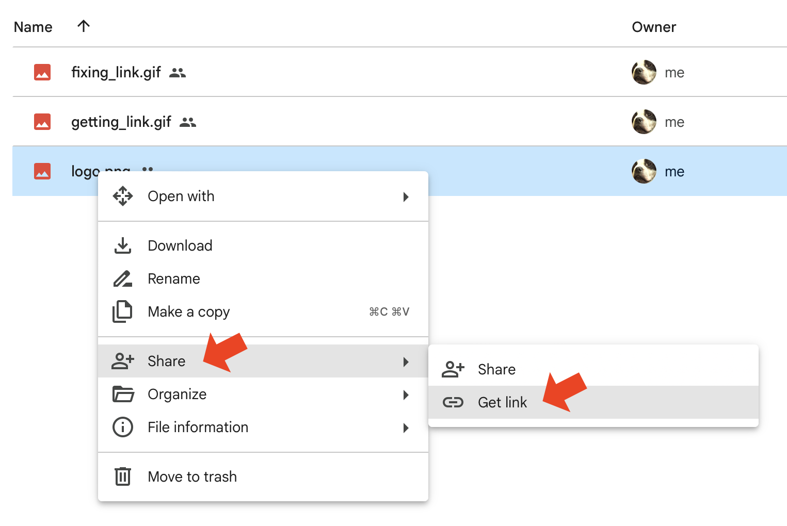
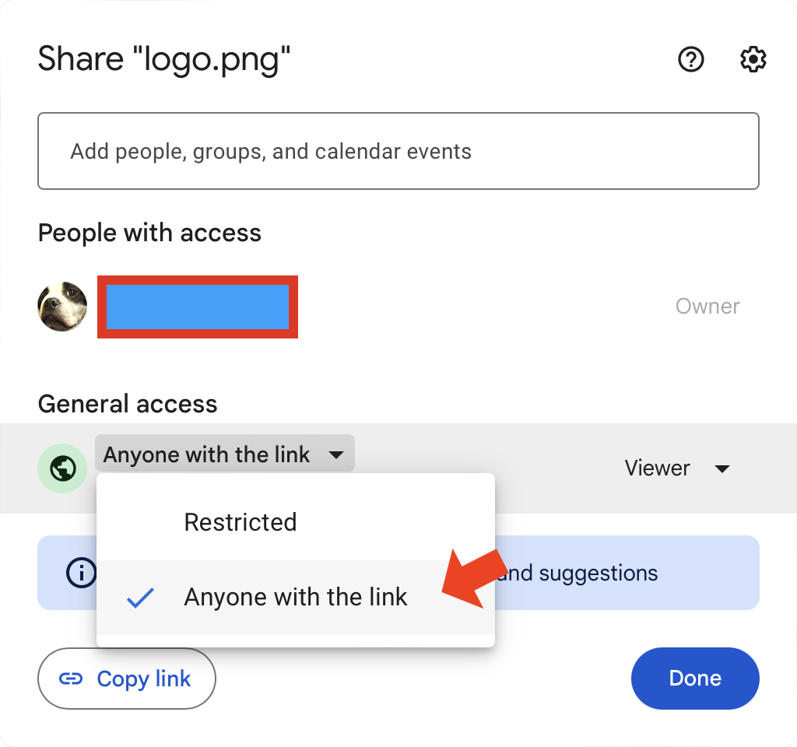

![GitHub][github]
![PyPI][pypi]
![PyPI - Status][pypi-stats]
![GitHub last commit][github-commit]
![GitHub issues][github-issues]
![PyPI - Downloads][pypi-downloads]
![GitHub repo size][github-size]
![PyPI - Python Version][pypi-version]

<br>

# glinkfix

<br>


## Google Drive Link Fixer

## Notes (please read)

1. Google periodically changes how Drive links are handled, which can
   affect tools like _glinkfix_. Direct downloading and embedding Google
   Drive links is unsupported behavior as far as Google is concerned. As
   of January 2024, Google made a significant change that broke some
   links created with this tool. _glinkfix_ now accepts current Drive
   file link formats such as `usp=drive_link`, but future Google changes
   may break link handling again.

2. Viewing links that point to animated GIFs may appear as static
   images.

3. In the v2 update, in addition to displaying the fixed link on the
   screen, _glinkfix_ will also attempt to copy the fixed link to the
   clipboard. Copying to the clipboard only works for desktop operating
   systems, not server environments. Even without automatic
   copying, link fixing will still work and the results will be
   displayed on the screen, regardless of where you run it. _glinkfix_
   uses the [pyperclip][def9] library, and automatic copying to the
   clipboard should work seamlessly on Windows and macOS. If you're
   running Linux and links are not automatically copied to the clipboard,
   [refer to this note][def8] from the pyperclip documentation.

## Installation

The preferred way to install _glinkfix_ is with [pipx][def3]:

```text
pipx install glinkfix
```

You can also install _glinkfix_ as a tool with [uv][def11]:

```text
uv tool install glinkfix
```

Alternatively, you can create a separate virtual environment and install
it the traditional way:

```text
pip3 install glinkfix
```

If you just need a quick one-time link fix and don't want to commit to
a full installation, use:

```text
pipx run glinkfix -h
```

and follow the directions to run it again with the option you want.

## Purpose and Usage

When you share files with Google Drive, the sharing link you get is
intended primarily for accessing the content through a web browser.
_glinkfix_ supports Google Drive file links such as
`https://drive.google.com/file/d/<file-id>/view?usp=drive_link`,
`.../preview`, and bare `/file/d/<file-id>` links. If you want to use a
Google Drive file sharing link to embed an image in a document (e.g. in
a Markdown or HTML file), or you want to directly download a file pointed
to by a Google Drive sharing link using something like `curl` or `wget`
in Linux, the link needs to be adjusted ("fixed") for these purposes.

It's not especially hard to repackage the link, but it can be tedious.
You have to copy the link to a text editor, carve it up manually, and
reassemble it. If you've got a lot of links to deal with, the process
gets repetitive. This tool is designed to remove that tedium.

_Note: The images below demonstrate Google Drive sharing links and their
"fixed" equivalents._

---

Start by getting a sharing link to a file on Google Drive. Make sure
it's set up for public access (_Anyone with the link_):



---



Now run _glinkfix_ with the sharing link:

```text
glinkfix "https://drive.google.com/file/d/<file-id>/view?usp=drive_link"
```

By default, _glinkfix_ creates an embeddable link, prints the result, and
attempts to copy the fixed link to the clipboard. To create a
direct-download link instead, use:

```text
glinkfix --download "https://drive.google.com/file/d/<file-id>/view?usp=drive_link"
```

For shell scripts, use `--quiet` to print only the converted URL:

```text
glinkfix --quiet "https://drive.google.com/file/d/<file-id>/view?usp=drive_link"
```

To print the normal output without copying to the clipboard, use:

```text
glinkfix --no-copy "https://drive.google.com/file/d/<file-id>/view?usp=drive_link"
```

If you run `glinkfix` without a URL, it prompts for one interactively.
Press `Ctrl-C` at the prompt to exit cleanly.

---

To display the help menu, run: `glinkfix -h`

```text
usage: glinkfix [-h] [-d] [--no-copy] [--quiet] [-v] [url]

Convert a Google Drive file sharing link into a link suitable for
embedding in a document, such as an image in Markdown or HTML, or for
direct download, such as with curl. glinkfix accepts current Drive file
link formats such as usp=drive_link and uses Python's standard-library
URL parser for lightweight, dependency-minimal processing. Google Drive
links used this way have a single-file size limit of 40 MB.

positional arguments:
  url             Google Drive file sharing link to convert. If omitted,
                  prompt for one.

options:
  -h, --help      show this help message and exit
  -d, --download  Create a direct-download link instead of the default
                  embeddable link.
  --no-copy       Do not copy the converted link to the clipboard.
  --quiet         Print only the converted link and skip clipboard copying.
  -v, --version   show program's version number and exit
```

## Usage Notes

* There is a 40 MB size limit for a single file when using Google Drive
  sharing links directly for viewing or downloading. Individual files
  larger than 40 MB will not render or download properly. This limit is a
  function of how Google Drive works and is not related to _glinkfix_.
* When creating a download link for use with `curl`, make sure to use
  `curl`'s `-L` option to allow for redirects.
* _glinkfix_ supports current Google Drive file sharing links, including
  `usp=drive_link`, `usp=drivesdk`, `usp=sharing`, and
  `usp=share_link`.
* _glinkfix_ supports links that use Google's [resource key][def6]
  security feature and preserves the resource key in fixed links.
* _glinkfix_ supports Drive file links only. It does not convert Google
  Drive folder links or native Google Docs, Sheets, or Slides editor
  links.
* The link parser uses Python's standard-library URL parsing tools for
  lightweight, dependency-minimal processing. New dependencies are
  acceptable when they provide a clear correctness, performance, or
  maintainability benefit.

### License

This project is licensed under the MIT License. See the [LICENSE][def5]
file for details.

### Acknowledgements

This project uses the [pyperclip library][def4], an external dependency
licensed under the BSD 3-Clause License. See the [pyperclip project][def4]
for license details.

<!--------------------------------------------------------------------->

[def3]: https://pipx.pypa.io/stable/
[def4]: https://github.com/asweigart/pyperclip
[def5]: ./LICENSE
[def6]: https://support.google.com/a/answer/10685032
[def8]: https://pyperclip.readthedocs.io/en/latest/index.html#not-implemented-error
[def9]: https://pypi.org/project/pyperclip/
[def11]: https://docs.astral.sh/uv/
[github-commit]: https://img.shields.io/github/last-commit/geozeke/glinkfix
[github-issues]: https://img.shields.io/github/issues/geozeke/glinkfix
[github-size]: https://img.shields.io/github/repo-size/geozeke/glinkfix
[github]: https://img.shields.io/github/license/geozeke/glinkfix
[pypi-downloads]: https://img.shields.io/pypi/dm/glinkfix
[pypi-stats]: https://img.shields.io/pypi/status/glinkfix
[pypi-version]: https://img.shields.io/pypi/pyversions/glinkfix
[pypi]: https://img.shields.io/pypi/v/glinkfix
